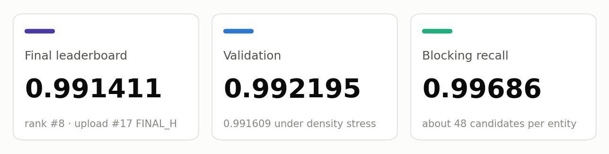
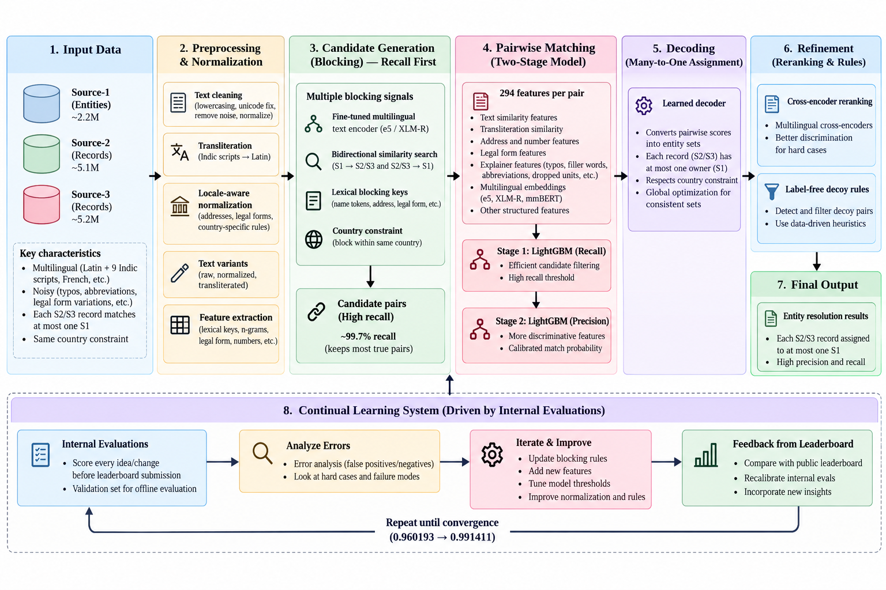
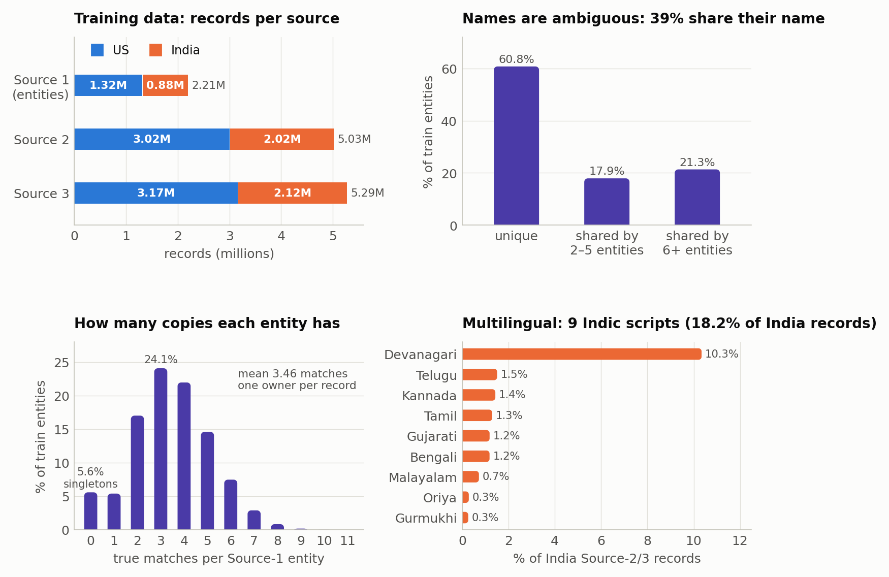
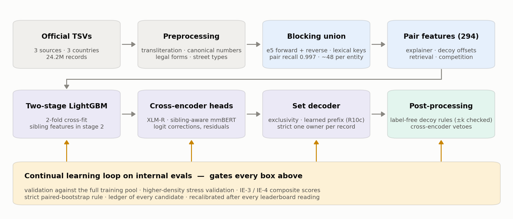
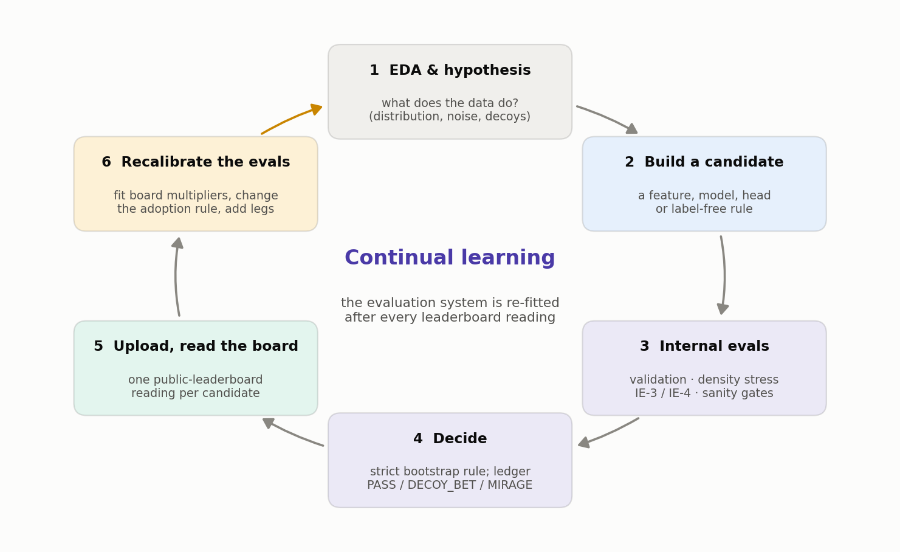
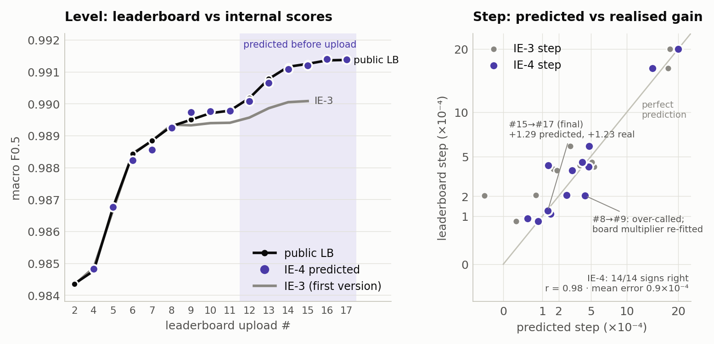

# Business Entity Resolution: ML Challenge 2026

### Team KL_converge

**Team Name:** KL_converge &nbsp;·&nbsp; **Team Members:** Shashvat Singh, Saumilya Gupta, Aditya Kumar &nbsp;·&nbsp; **Submission Date:** 2026-09-27

Final submission: upload #17 `FINAL_H` · final leaderboard **0.991411** · rank **#8**

[Summary](#1-executive-summary) · [Data](#21-problem-analysis-eda) · [Continual learning](#24-a-continual-learning-system-built-on-internal-evals) · [Blocking](#3-candidate-generation-blocking) · [Model](#4-matching-model) · [Results](#5-results--error-analysis) · [Code](#a-code-artefacts)

---

## 1. Executive Summary

We treat entity resolution as a **many-to-one assignment problem**. A recall-first blocking step, built on a fine-tuned multilingual encoder searched in both directions plus lexical keys, keeps 99.7% of true pairs. A two-stage LightGBM matcher then scores each pair with 294 features, many of which reverse-engineer how the data generator corrupts records. A learned decoder turns those scores into one set per entity, giving every record at most one owner. Multilingual cross-encoders and label-free decoy rules refine the result.

The part we are proudest of is the **continual learning system built on our internal evaluations**. Every idea was scored by internal evals before it reached the leaderboard, and every leaderboard reading was fed back to recalibrate those evals. This took us from 0.960193 to 0.991369 on the public board, and to **0.991411 (rank #8)** on the final leaderboard.

 <em>System overview. Seven pipeline stages run left to right, from the three input sources to the final one-owner assignment. The continual learning loop underneath (Section 2.4) decided every change to them.</em>

---

## 2. Methodology

### 2.1 Problem Analysis (EDA)

We ran exploratory analysis throughout the challenge, not only at the start. Whenever the leaderboard disagreed with our validation, we went back to the data to find out why. Figure 1 shows the basic shape of the training data, measured on the official files.

 <em>Figure 1. Spread of the training data. Top left: about 2.2M Source-1 entities and 10.3M Source-2/3 records. Top right: 39% of entities share their exact name with at least one other entity, so a name alone rarely identifies a business. Bottom left: an entity has 0–11 copies, 3.46 on average, and 5.6% have none. Bottom right: 18% of India records spell the name in one of nine Indic scripts.</em>

What the EDA found, and what we built because of it:

| finding                                                                                                                                                                 | evidence                                                                                                                                    | what we built                                                                                                                                                |
| ----------------------------------------------------------------------------------------------------------------------------------------------------------------------- | ------------------------------------------------------------------------------------------------------------------------------------------- | ------------------------------------------------------------------------------------------------------------------------------------------------------------ |
| **The truth is a set of stars.** Each S2/S3 record is a copy of at most one S1, and a record and its S1 always share a country.                                         | Of 7.64M matched ids, none appears under two S1.                                                                                            | Blocking within each country; a decoder that lets each record have at most one owner.                                                                        |
| **The data is multilingual.** India names come in Latin script and nine Indic scripts, and French records bring their own address and legal-form conventions.           | 18.2% of India records use an Indic script, yet there are only 1,534 distinct Indic words in total.                                         | A transliteration view kept next to the raw text; multilingual encoders (e5, XLM-R, mmBERT); locale-aware normalisation of French addresses and legal forms. |
| **The noise is programmatic.** Copies are made by a small set of operations: typos, filler words, legal-form restyles, abbreviations, dropped units and number changes. | A copy equals its S1 in both name and address in ≤ 0.02% of cases, but after romanisation only 2.1–2.3% of true pairs have unrelated names. | "Explainer" features that name which operation links an S1 to a record (Section 4).                                                                          |
| **Decoys sit a few house numbers away.** Some distractors repeat an S1 name plus one extra word at house number S1 + k, with k ∈ {1, 2, 3, 4, 5, 7, 9, 11, 13, 21}.     | The same extra words at offset 0 are harmless filler words of true copies.                                                                  | Offset-aware decoy features, and removal rules checked by a mirror test (Section 2.5).                                                                       |
| **Names alone are ambiguous.**                                                                                                                                          | 39% of entities share their exact name with another entity (Figure 1).                                                                      | Address and house-number evidence, and competition features that compare all entities claiming the same record.                                              |
| **Empty addresses carry most of the loss.**                                                                                                                             | 3.3% of records have no address; 97.7% of those are still true copies of some S1.                                                           | A dedicated empty-address search channel, a specialist model and rules.                                                                                      |

### 2.2 Solution Strategy

**Approach type:** Hybrid. Blocking, then a gradient-boosted pair classifier, then cross-encoder re-scoring, then a learned assignment decoder, then label-free post-processing.
**Core innovations:**

1. Reverse-engineering the data generator into interpretable features.
2. Decoy detection conditioned on house-number offsets.
3. An assignment-aware decision layer that respects "one owner per record".
4. A continual learning system on internal evaluations that decided every change.

 <em>Figure 2. The pipeline. Every stage was changed only when the internal-eval loop (bottom) said the change was real.</em>

### 2.3 Data Preprocessing

- **Parsing.** The TSVs are read with quoting disabled, because many business names contain quote characters that would otherwise break rows.
- **Scripts.** Indic words are mapped to Latin through a 1,534-word dictionary: 1,363 entries were read off the training ground truth, 165 were proposed offline by the IndicXlit model, and 6 were added by hand. The text is then folded to ASCII with anyascii. The raw text is always kept as a second view, so no information is lost.
- **Names.** We fold case and accents, and strip legal forms (`Pvt Ltd`, `LLC`, `SARL`…) and honorifics to get a _name core_, using per-country lists. Country tags are removed. Junk and placeholder names are flagged as missing rather than matched. Alias tails and web-address stems get their own views, and we compute a phonetic skeleton so that vowel-less transliterations still match.
- **Addresses.** House numbers are compared as integers (so `00101` equals `101`), using every part of a multi-part number. Street types are canonicalised (`St`/`Street`, `Rd`/`Road`). State or department is mapped to region, and French forms such as Saint/St, bis/ter and `N°` are normalised.
- **Statistics.** We compute per-record frequencies and IDF vocabularies, and learn per-country lists of filler words, legal forms and street words from the provided data.

**Preprocessing ideas that did not pan out.** Canonicalisation helps, but the data varies too much for normalisation rules to decide a match by themselves.

- **Number normalisation as a matching rule.** Canonical numbers are still computed (for example `00101` → `101`), but "same number after normalisation" failed as a rule. The closest number in a true copy equals the S1 number in only 90.0% of pairs (verbatim: 73.4%). Copies drop digits (2.9–4.4%), substitute digits (1.5–1.6%), turn numbers into ranges or halves, and in India insert extra numbers behind `DOOR NO` / `H.NO` (11.6–12.9%). We now use canonical numbers only as inputs to learned number-relation features.
- **Semantic / similarity matching of numbers.** Comparing numbers as text (embeddings, fuzzy ratios) rates `12 Main St` and `13 Main St` as near-identical, which is exactly where the generator plants decoys (offsets +1 to +21). Explicit signed-offset features replaced it; the decoy block alone added +0.00032 validation.
- **Postal codes.** The data has none. US 5-digit tokens are zero-padded house numbers or PMB numbers, so a postal-code key was ruled out.
- **Other normalisers:**
  - unidecode lost to anyascii on every script (and is GPL);
  - embedding-based transliteration (LaBSE hit@1 0.815, bge-m3 0.731) lost to the 1,534-word dictionary plus character TF-IDF (0.942);
  - per-country IDF (−0.00016) and distribution alignment (quantile, DANN / CORAL / MMD; ≈ 0) did not help;
  - applying the French address canonicalisation to every country cost −0.00012, so it is gated by country.

### 2.4 A continual learning system built on internal evals

The public leaderboard gives one noisy number per upload, and uploads were limited. So we built a system that _learns how to evaluate_. Internal evals decide which candidates are worth an upload, and each leaderboard reading teaches the evals where they were wrong. Figure 3 shows the loop we ran for three days.

 <em>Figure 3. The continual learning loop. Step 6 is what makes it "continual": the evaluation system is re-fitted after every leaderboard reading.</em>

**The internal evaluations (step 3):**

- **A validation set that behaves like the real task.** We hold out 220,730 training entities by hash, but match them against the _full_ 10.3M-record training pool. That way a validation entity competes with all 2.2M training entities for records, just as in the real task. A 30,000-entity locked holdout is kept apart. The rest is split into a TUNE half, used to choose settings, and a REPORT half, used once to report. The scorer reproduces the official macro F0.5, including the singleton rule.
- **Higher-density stress validation.** A general matcher must hold up when there are more distractors per entity. We rebuilt the validation universe with 19% of training entities removed, so their records become ownerless distractors (5.77 instead of 4.68 records per entity). Every retrieval list and feature was then recomputed. This view exposed models that looked equal on ordinary validation but were fragile under more competition.
- **Composite scores IE-3 and IE-4.** These combine the validation views above with label-free estimates for the parts validation cannot label, and a mirror check for decoy-removal rules (Section 2.5). They also carry sanity gates: matches per entity must stay in the expected range, and no record may have two owners. IE-4 predicts the leaderboard step of a candidate relative to an upload that has already been graded.
- **A strict adoption rule.** A change is kept only if its gain on REPORT plus the locked holdout has a 95% paired-bootstrap interval above zero in both the ordinary and the density-stress view. Name clusters are resampled together, because near-duplicate names share errors.
- **A ledger of every candidate.** Each candidate gets a verdict:
  - **PASS**: meets the adoption rule.
  - **DECOY_BET**: a removal rule that validation cannot judge, priced by the mirror check instead.
  - **MIRAGE**: a gain that disappears under honest assumptions.

  Dead ends were written down, so nobody re-opened them.

**How the evals learned from the board (step 6), with real examples:**

1. **After upload #9**, the mirror leg had predicted +0.000437 for a US decoy-removal rule, but the board paid +0.000203. We fitted a board multiplier (0.49) on that leg and used it from then on.
2. **After upload #10**, the first composite score (IE-3) had drifted below the board, because it could not see decoy patterns that are rare in validation. We replaced it with IE-4. It freezes the uncertain bands, so a model cannot look better just by becoming more confident. It also adds a mirror leg for decoy rules, count gates, and a leaderboard-calibrated leg for the part validation cannot label.
3. **After #12 and #13** paid about 1.3× their density-view gains, the adoption rule switched to the density view. **After #14**, it became the "both views must pass" rule above.
4. **A 1.27× under-credit factor** fitted on #12–#13 was tracked and retired once #16 and #17 landed at 0.76× and 0.95× of their predictions.

**How well the internal evals matched the leaderboard.** Figure 4 compares predicted and realised scores for every graded upload. IE-4 predicted the direction of **all 14 leaderboard steps** correctly (the first eight as backtests), with a correlation of 0.98 between predicted and realised steps. For the final upload it predicted +0.000129 and the board gave +0.000123.

 <em>Figure 4. Internal evals vs the public leaderboard. Left: absolute scores per upload; IE-3 (grey) drifted from upload #9 on, which is why IE-4 was built. Right: predicted vs realised step for each upload, on a square-root scale so the small steps are readable. IE-4 was built after upload #10, so steps up to #10 are leave-one-out backtests, #11 is a holdout, and from #12 on every prediction was made before the upload.</em>

| step (predicted before upload) | IE-4 predicted | leaderboard realised |
| ------------------------------ | -------------- | -------------------- |
| #11 → #12                      | +0.000302      | +0.000390            |
| #12 → #13                      | +0.000482      | +0.000604            |
| #13 → #14                      | +0.000308      | +0.000381            |
| #14 → #15                      | +0.000038      | +0.000091            |
| #15 → #16                      | +0.000145      | +0.000110            |
| #15 → #17 (final)              | +0.000129      | +0.000123            |

### 2.5 Interpretability checks

We required every change to make mechanical sense, not only to raise a number.

- **Features with meaning.** Each explainer feature answers a concrete question: "which generator operation turns this S1 into this record, and what is left unexplained?" For example, the name is explained for 97.5–99.8% of true pairs, against 16.8–46.8% of hard non-matches, so the model's decisions can be read back as reasons.
- **Importance audits.** The most important feature of the shipped model is the fine-tuned encoder's _reverse rank_: how highly the record ranks this S1 among all S1 (47% of stage-1 gain). That fits the many-to-one structure, since a record's best-looking S1 is usually its owner. The decoy block carries 6.4%.
- **The mirror test for every removal rule.** Decoys are placed only _above_ the S1 house number (+k), while true copies with a mistyped number are equally likely to land above or below. So a rule that removes many pairs at +k, while the same pattern barely occurs at −k, is removing decoys. The −k count estimates how many true copies it would wrongly remove. For example, one country-tag rule selected 761 pairs at +k against 4 at −k, so it was accepted. Rules without this signature were rejected, however good their validation looked.
- **Reading the data and checking for leakage.** We read samples of the pairs each change touched, and ran per-entity error analyses of every upload. We also ruled out record ids and file row order as hidden signals.
- **Negative results kept.** Several hundred probability ensembles never beat their best member on the stress views, and retraining the base model on more data added about zero. Name-only matching of empty-address records reached 0.30–0.62 precision, against the 0.72 needed to break even. All three were rejected and logged.

---

## 3. Candidate Generation (Blocking)

Blocking decides which S1–record pairs the model ever sees, so it sets the recall ceiling. We therefore combined several channels that fail on _different_ records.

- **Blocking keys used.** A record and its S1 always share a country, so all channels search within one country (this loses nothing), and their candidate lists are unioned.
  - **Dense channel.** multilingual-e5-small, fine-tuned contrastively for one epoch on 150k training pairs, encodes `name | address`. For each S1 we take its 20 nearest records. We also search in _reverse_: from each record to all S1, keeping its best S1, plus S1 ranked 2–5 when they score within 0.03 of the best. The reverse direction rescues records that rank low from their own S1's side, e.g. when an S1 has many similar-looking records.
  - **Lexical channels.**
    - rarest-first compound keys on the transliterated name × address;
    - address-only keys, for copies whose name is badly damaged;
    - reverse versions of both;
    - character TF-IDF on names, for records with no address.
- **Candidate pairs generated.** 83,761,275 in the submitted `candidate_pairs.tsv`, about 48 per S1.
- **How we ensured true matches were not lost.** Compound keys alone recall 0.9305 of true pairs. The union reaches a **pair recall of 0.99686** on validation, which caps macro F0.5 at **0.99909** even if the model were perfect. Only 0.3% of true pairs are never considered. That was the right trade, because a false merge costs about twice as much as a miss.

---

## 4. Matching Model

**Features used.** Stage 1 uses 294 features in six families: 89 base, 37 channel-evidence, 127 explainer, 12 additions, 15 decoy and 14 second-explainer.

- **Name:** rapidfuzz string similarities on the raw and transliterated views, IDF-weighted word overlap and coverage, phonetic agreement, and legal-form and filler-word flags.
- **Address:** integer house-number relations (equal, signed offset, agreement of every part of a multi-part number), street-key and token overlap, and unit, admin and region consistency.
- **Explainers:** two independently written programs that try to _replay the generator_. Their outputs are which operations turn the S1 into the record, which words are left unexplained, how rare those words are, and what class of number change occurred.
- **Decoy block:** the signed house offset, whether it falls in the decoy offset set, and whether the name is "S1 core + one decoy or filler word", with their interactions.
- **Retrieval and competition:** dense cosine, forward and reverse ranks per channel, and how strongly _other_ S1 compete for the same record.
- **Stage 2:** 13 list-level competition features, plus 6 sibling features that ask whether the S1's other candidate records agree with this one.

**Model type.**

- **Base matcher:** a LightGBM binary classifier (127 leaves, learning rate 0.05, early stopping), cross-fitted in two folds by S1 hash on a 370,905-entity training sample. Stage 2 is trained on out-of-fold stage-1 scores: each entity is scored by the fold model that did not train on it.
- **Cross-encoders:** a cross-encoder reads both records together as one input, which is slower but more accurate than the encoder used for blocking. We fine-tuned XLM-R-base cross-encoders on hard pairs mined by the matcher and added their evidence as logit corrections and as a LightGBM residual.
- **Context head:** LightGBM residual heads over **sibling-aware context cross-encoders** (mmBERT-base fine-tunes), applied to the countries that have training labels. Besides the S1 and the candidate record, the model also sees the strongest _competing_ S1 for that record and another record the S1 already owns. It can therefore judge "which of these two businesses is this a copy of?" The final head averages 16 such heads and blends them 50/50 with one trained with density weighting.

**Threshold selection method.** There is no single global threshold. The decision is made per entity in three steps, and the policy was chosen on validation.

1. **Exclusivity.** A pair survives only if its probability is at least that of the best _other_ S1 for the same record.
2. **Learned prefix decoder (R10c).** For each entity, sort its surviving candidates by probability. A second LightGBM model predicts the F0.5 the entity would score if we kept the top k, for k = 0…10, and we keep the k with the best predicted score. This builds F0.5's precision weighting and the singleton rule (k = 0) into the decision itself.
3. **Strict one-owner.** If two entities still claim the same record, only the higher-probability claim is kept.

**Post-processing (label-free, mostly removals):**

- **Decoy removal rules:** pairs matching a decoy pattern at +k offsets (a legal form, country tag or one extra word added to the S1 name), and same-address pairs where one generic word was swapped. Each rule had to pass the mirror test.
- **Cross-encoder vetoes:** pairs the cross-encoders consider almost certainly wrong.
- **Empty-address rules:** empty-address copies of a shared name are dropped when the S1 already has address evidence elsewhere. Unowned empty-address records are added to uniquely named S1 when the head is confident (p > 0.7).
- **Safeguards:** most rules never empty an S1. Layers after upload #8 were kept or dropped using the internal evaluations and public-leaderboard readings.

---

## 5. Results & Error Analysis

- **F0.5 score (macro, validation):** **0.992195** on ordinary validation, 0.991609 on the higher-density stress validation. The base matcher alone scores 0.99001. Leaderboard: **0.991411 final (rank #8)**; 0.991369 on the public board.

| stage                                                                     | uploads | public LB after | gain          |
| ------------------------------------------------------------------------- | ------- | --------------- | ------------- |
| Base matcher (explainer, decoy and competition features, learned decoder) | #1–#5   | 0.986761        | from 0.960193 |
| Cross-encoder corrections, number residuals, empty-address specialist     | #6–#8   | 0.989292        | +0.002531     |
| Label-free decoy removal layers                                           | #9–#11  | 0.989780        | +0.000488     |
| Cross-encoder residual and first cross-encoder heads                      | #12–#13 | 0.990774        | +0.000994     |
| Sibling-aware context heads and rule layers                               | #14–#17 | 0.991369        | +0.000595     |

- **Common false positives (wrong merges):**
  - **Generator decoys:** an S1 name plus a legal form, country tag or extra word, a few house numbers higher.
  - **Look-alikes at the same address:** one generic word of the name swapped, e.g. `Club` → `Comité`.
  - **Same-name entities** at nearby numbers, and different businesses sharing a building.
  - **Empty-address records claimed by the wrong S1** when several S1 have the same name.

  The post-processing layers target the first three.

- **Common false negatives (missed matches):**
  - **Empty-address copies of shared names:** half to two-thirds of the remaining validation loss. When several S1 share a name and the copy has no address, nothing in the record says which one owns it. The best possible guess is right 1 time in n.
  - **Uniquely named empty-address copies** whose name was also noised.
  - **Entities predicted empty** that do have a match.
  - **Blocking misses:** 10–16% of the loss.

  Transliteration misses, a visible class early on, are essentially solved by the dictionary view.

---

## 6. Conclusion

Most of our score came from understanding the data rather than from bigger models. Inverting the generator, respecting the one-owner structure and blocking for recall took the base matcher to 0.99001 validation. Multilingual cross-encoders and mechanism-checked rules added the final +0.0046 on the leaderboard.

Our main lesson is that fast iteration is only safe when the evaluation keeps learning too. Evaluations that stress what plain validation hides (more distractors, decoys, unlabelled data), recalibrated after every leaderboard reading, let us make quick keep-or-drop decisions. Plain validation mis-ranked several of our best changes.

---

## Appendix

### A. Code Artefacts

`code/business_entity_resolution/src/` (commands and runtimes are in its `README.md`; figure sources in `docs/figures/`):

| entry point                                                                          | what it does                                                                                                                                                                                                           |
| ------------------------------------------------------------------------------------ | ---------------------------------------------------------------------------------------------------------------------------------------------------------------------------------------------------------------------- |
| `run_all.sh` (`prepare.py` → `block.py` → `features.py` → `train.py` → `predict.py`) | the base matcher end to end: records → blocking union (=`output/candidate_pairs.tsv`) → features → 2-stage LightGBM → decoder                                                                                          |
| `final_reproduce.py --target FINAL_H`                                                | rebuilds the submitted`output/matching_results.tsv` byte-exactly (md5 `0a7c6cf66acbfbf3677d25ae29b804b5`, about 25 s, Python ≥ 3.11 + polars) from frozen decision tables; `ens8_reproduce.py` rebuilds uploads #8–#10 |
| `validate.py`                                                                        | the official validator; both output files pass with`--check-ids`                                                                                                                                                       |
| `research_ensemble/`, `resources/`                                                   | verbatim research scripts of every ensemble and rule step, trained models, frozen lists                                                                                                                                |

### B. Open models used

| model                                           | licence    | parameters | use                                             |
| ----------------------------------------------- | ---------- | ---------- | ----------------------------------------------- |
| intfloat/multilingual-e5-small (+ 2 fine-tunes) | MIT        | 118M       | dense blocking channel                          |
| FacebookAI/xlm-roberta-base (fine-tunes)        | MIT        | 278M       | pair cross-encoders, vetoes                     |
| jhu-clsp/mmBERT-base (fine-tunes)               | MIT        | 308M       | context cross-encoders of the head, vetoes      |
| Lajavaness/sentence-camembert-large             | Apache-2.0 | 336M       | similarity signal in one removal rule           |
| LightGBM 4.7                                    | MIT        | trees      | matcher, decoders, residuals, heads             |
| AI4Bharat IndicXlit                             | MIT        | ~11M       | used once offline to propose dictionary entries |
